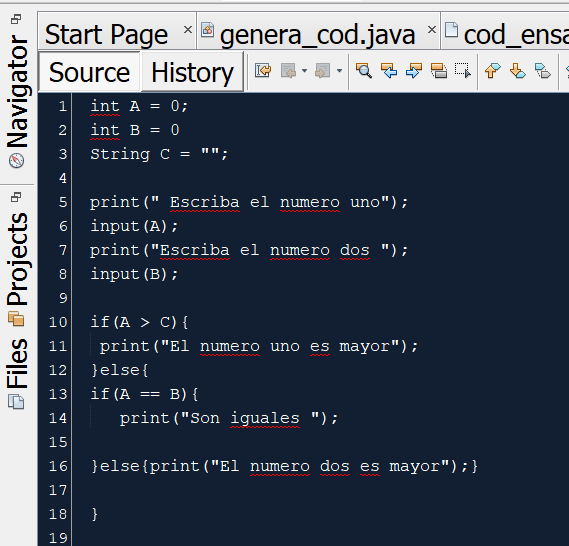
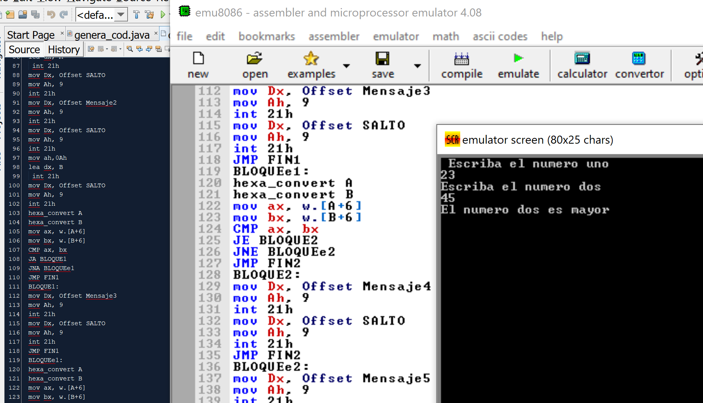

Hello there  
This is a program (compiler) that translates my own programming language into Assembly language (made in java).  
The sintax is very easy to understand, and contains only the basics.  
The grammar, syntax trees and regular expressions are in the "grama_arbo_E.R" file.   

Inside the "compi" folder is all the code (java files and txt files).  
In "mi_lenguaje" file you can write my language. For example here, this code has 2 errors, which will be shown in the error table when the program is run.  

 

 
Once you have written without errors, the "cod_ensam.txt" file will be written automatically in assembly language, and then you can copy and paste it into an assembly language emulator 8086, in my case I used this https://emu8086.waxoo.com/ 
 

  

Forgive my lack of professionalism using github, I'm just learning how to use it.   
Also sorry for the parts that are in Spanish, the compiler was going to review it in Spanish at my university.

